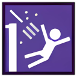
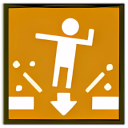
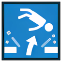
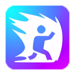
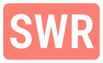
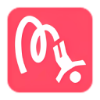
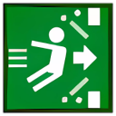
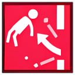
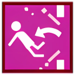
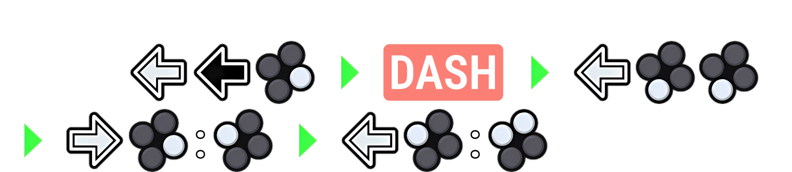

# Tekken 8 API v1.0.2

This API provides Tekken 8 move data and notation generation tools, sourced from WavuWiki. It includes features to retrieve and search movesets, and a notation maker that detects starter frames and generates button notation images.

# Features

- **Notation Maker**: Detects the starter frame for any move and creates images with the button notation.
- **Get All Movesets**: Fetches the complete list of moves available in Tekken 8.
- **Search Moveset**: Allows users to search for specific movesets based on notation.

## API Reference

#### Notation Maker

```json
  POST /notation
```

| Parameter        | Type     | Description                  |
| :--------------- | :------- | :--------------------------- |
| `character_name` | `string` | \*Character Name of Tekken 8 |
| `notation`       | `string` | \*Your notation              |

##### Notation reference

| Raw notation  | How to request | Description                                              | Output Image                         |
| :------------ | :------------- | :------------------------------------------------------- | :----------------------------------- |
| `1`           | `1`            | `Left Punch`                                             |         |
| `2`           | `2`            | `Right Punch`                                            |         |
| `3`           | `3`            | `Left kick`                                              |         |
| `4`           | `4`            | `Right kick`                                             |         |
| `1+2`         | `1+2`          | `Left punch and right punch, pressed together.`          |       |
| `1+2+3`       | `1+2+3`        | `Left and right punch, then left kick pressed together`  |     |
| `1+2+3+4`     | `1+2+3+4`      | `Ki Charge`                                              |   |
| `1+3`         | `1+3`          | `Left Punch and left kick pressed together`              |       |
| `1+3+4`       | `1+3+4`        | `Left punch, then left and right kick pressed together`  |     |
| `1+2+4`       | `1+2+4`        | `Left and right punch, then right kick pressed together` |     |
| `1+4`         | `1+4`          | `Left Punch and right kick pressed together`             |       |
| `2+3`         | `2+3`          | `Right Punch and left kick pressed together`             |       |
| `2+3+4`       | `2+3+4`        | `Right Punch, then left and right kick pressed together` |     |
| `2+4`         | `2+4`          | `Right Punch and right kick pressed together`            |       |
| `3+4`         | `3+4`          | `Left and right kick pressed together`                   |       |
| `u`           | `u`            | `Up`                                                     |         |
| `U`           | `U`            | `Up (Hold)`                                              |        |
| `ub`          | `ub`           | `Up and backward`                                        |        |
| `UB`          | `UB`           | `Up and backward (Hold)`                                 |      |
| `uf`          | `uf`           | `Up and forward`                                         |        |
| `d`           | `d`            | `Down`                                                   |         |
| `D`           | `D`            | `Down (hold)`                                            |        |
| `db`          | `db`           | `Down and backward`                                      |        |
| `DB`          | `DB`           | `Down and backward (hold)`                               |      |
| `df`          | `df`           | `Down and forward`                                       |        |
| `DF`          | `DF`           | `Down and forward (hold)`                                |      |
| `b`           | `b`            | `Back`                                                   |         |
| `B`           | `B`            | `Back (Hold)`                                            |        |
| `f`           | `f`            | `Forward`                                                |         |
| `F`           | `F`            | `Forward (hold)`                                         |        |
| `cc`          | `cc`           | `Crouch cancel (u~n)`                                    |        |
| `BB!`         | `BB!`          | `Balcony break`                                          |     |
| `CD`          | `CD`           | `Crouch dash`                                            |      |
| `CH`          | `CH`           | `Counter Hit`                                            |      |
| `FB!`         | `FB!`          | `Floor Break`                                            |     |
| `FBl!`        | `FBl!`         | `Floor Blast`                                            |    |
| `FC!`         | `FC!`          | `Full Crouch`                                            |      |
| `H`           | `H!`           | `During Heat`                                            |        |
| `RA`          | `R`            | `Rage Art`                                               |        |
| `SS`          | `SS`           | `Side Step`                                              |      |
| `SSL`         | `SSL`          | `Side Step Left`                                         |    |
| `SSR`         | `SSR`          | `Side Step Right`                                        |    |
| `SWL`         | `SWL`          | `Side Walk Left`                                         |    |
| `SWR`         | `SWR`          | `Side Walk Right`                                        |    |
| `T!`          | `T!`           | `Tornado`                                                |       |
| `UF`          | `UF`           | `Up and forward (Hold)`                                  |      |
| `W!`          | `W!`           | `Wall Splat, Wall Bounce`                                |       |
| `WB!`         | `WB!`          | `Wall Break`                                             |     |
| `WBl!`        | `WBl!`         | `Wall Blast`                                             |    |
| `WBo!`        | `WBo!`         | `Wall Bound`                                             |    |
| `WR`          | `WR`           | `While Running`                                          |      |
| `WS`          | `WS`           | `While Standing`                                         |      |
| `DASH`        | `dash`         | `Dash (f,f)`                                             |      |
| `Deep Dash`   | `ddash`        | `DEEP DASH`                                              |     |
| `iWS`         | `iWS`          | `Instant While Standing`                                 |     |
| `iWR`         | `iWR`          | `Instant While Running`                                  |     |
| `Micro Dash`  | `mdash`        | `Micro Dash`                                             |     |
| `Neutral (☆)` | `n`            | `Neutral (☆)`                                            |         |
| `During Rage` | `rage`         | `During Rage`                                            |      |
| `~`           | `~`            | `Followed by, immediately`                               |         |
| `:`           | `:`            | `Followed by, tight input window`                        |   |
| `<`           | `<`            | `Followed by, with delayed input`                        |  |
| `>`           | `>`            | `Followed by, with delayed input`                        |  |
| `*`           | `*`            | `Held input`                                             |    |
| `►`           | ` `            | `Next`                                                   |    |
| `[`           | `[`            | `Optional start`                                         |         |
| `]`           | `]`            | `Optional end`                                           |         |

| Raw notation  | How to request        | Description                                   |
| :------------ | :-------------------- | :-------------------------------------------- |
| `qcf`         | `qcf`                 | `Same as d,df,f`                              |
| `qcb`         | `qcb`                 | `Same as d,db,b`                              |
| `hcf`         | `hcf`                 | `Same as b,db,d,df,f`                         |
| `hcb`         | `hcb`                 | `Same as f,df,d,db,b`                         |
| `dp`          | `dp`                  | `Same as f,d,df`                              |
| `RA`          | `RA`                  | `Same as R`                                   |
| `ewgf`        | `ewgf`                | `Same as f,n,d,df,2`                          |
| `EWGF`        | `EWGF`                | `Same as f,n,d,df,2`                          |
| `HB`          | `HB`                  | `Same as 2+3,H`                               |
| `HS`          | `HS`                  | `Same as H,2+3`                               |
| `name_stance` | `stance(name_stance)` | `For using stance, use 'stance(name_stance)'` |
| `STB`         | `stance(STB)`         | `e.g for using stance'`                       |

#### Find moveset

```json
  POST /findmove
```

| Parameter        | Type     | Description                  |
| :--------------- | :------- | :--------------------------- |
| `character_name` | `string` | \*Character Name of Tekken 8 |
| `name_move`      | `string` | Name move to find            |
| `notation`       | `string` | Notation to find             |

#### Get moveset

```json
  POST /movetable
```

| Parameter        | Type     | Description                  |
| :--------------- | :------- | :--------------------------- |
| `character_name` | `string` | \*Character Name of Tekken 8 |

## Usage/Examples

#### Notation Maker:

```json
POST /notation
{
    "character_name": "lee",
    "notation": "b,B+4 dash b,3,3 f,4:1 b,1:1+2"
}
```

Output will be:


#### Get movetable:

```http
POST /movetable
{
    "character_name": "kazuya"
}
```

Output will be:

```json
{
  "total_data": 124,
  "data": [
    {
      "moveset": "Kazuya-1",
      "name_move": "Jab",
      "startup": "i10",
      "hit_properties": "h",
      "damage": "5",
      "on_block": "+1",
      "on_hit": "+8",
      "on_CH": "",
      "states": "",
      "notes": "Recovers 2f faster on hit or block (t27 r17)"
    },
    {
      "moveset": "Kazuya-1,1",
      "name_move": "",
      "startup": ",i15",
      "hit_properties": ",h",
      "damage": ",6",
      "on_block": "-1",
      "on_hit": "+8",
      "on_CH": "",
      "states": "",
      "notes": "JailsCombo from 1st hit"
    }
  ]
}
```

#### Findmove:

```http
POST /findmove
{
    "character_name": "claudio",
    "notation": "1"
}
```

```http
POST /findmove
{
    "character_name": "claudio",
    "name_move": "jab"
}
```

Output will be:

```json
{
  "total_data": 1,
  "data": [
    {
      "moveset": "Claudio-1",
      "name_move": "Jab",
      "startup": "i10",
      "hit_properties": "h",
      "damage": "5",
      "on_block": "+1",
      "on_hit": "+8",
      "on_CH": "",
      "states": "",
      "notes": "Recovers 2f faster on hit or block (t27 r17)"
    }
  ]
}
```

## Run Locally

Clone the project

```bash
  git clone https://github.com/dammar01/Tekken8-API
```

Go to the project directory

```bash
  cd Tekken8-API
```

Add venv

```bash
  py -m venv venv
```

Activate venv

```bash
  venv\Scripts\activate
```

Install dependencies

```bash
  pip install -r requirements.txt
```

Start the server

```bash
  uvicorn app.main:app --reload
```

Access server

```bash
  http://127.0.0.1:8000
```

## Run In Docker

Start the server

```bash
  docker pull dmmrs/tekken8-api:v1.0.2
```

Run the server

```bash
  docker run -d -p 8000:8000 dmmrs/tekken8-api:v1.0.2
```

Access server

```bash
  http://127.0.0.1:8000
```

## Contributing

Contributions are always welcome!

Feel free to customize any section to better fit your project structure!

## Feedback

If you have any feedback, please reach out to me at dammar.s011@gmail.com or DM me at instagram [@dmmrs_a](https://www.instagram.com/dmmrs_a/)

## Acknowledgements

- [WavuWiki](https://wavu.wiki/t/Main_Page)

## License

This project is licensed under the Mozilla Public License 2.0 (MPL-2.0). For more details, see the [LICENSE](LICENSE) file
